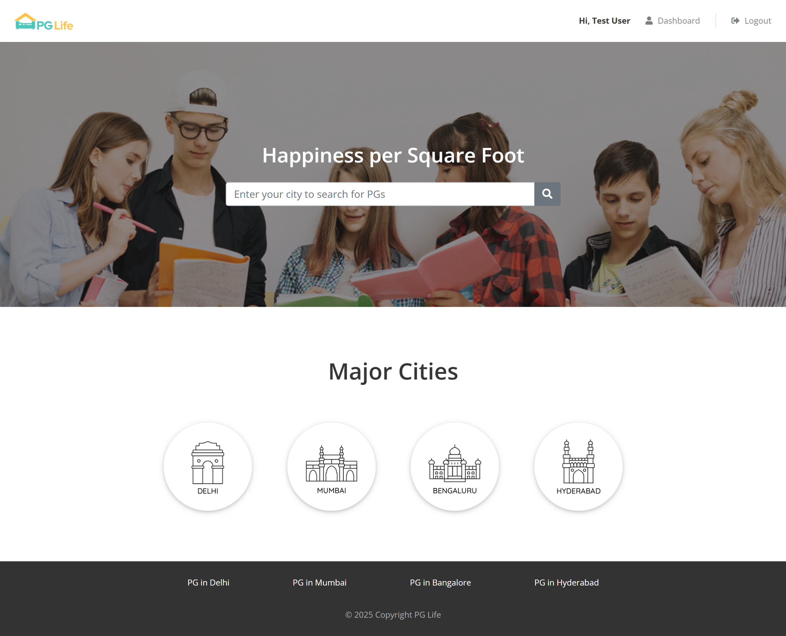
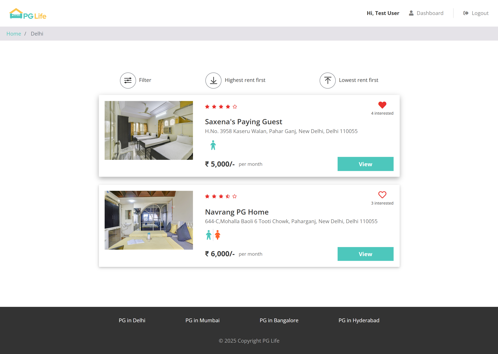
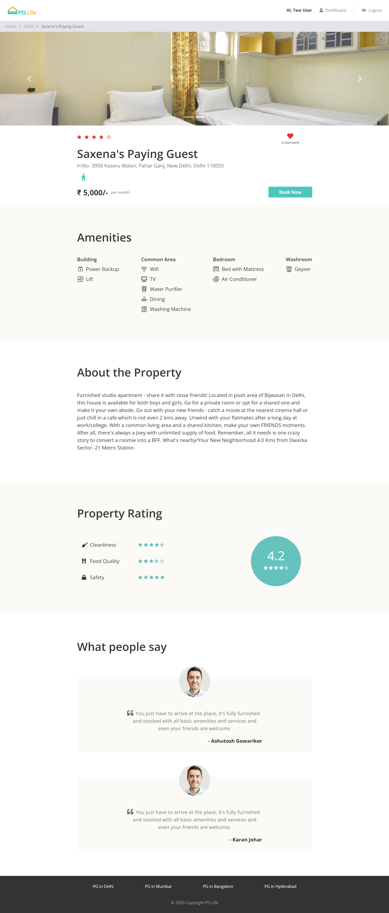
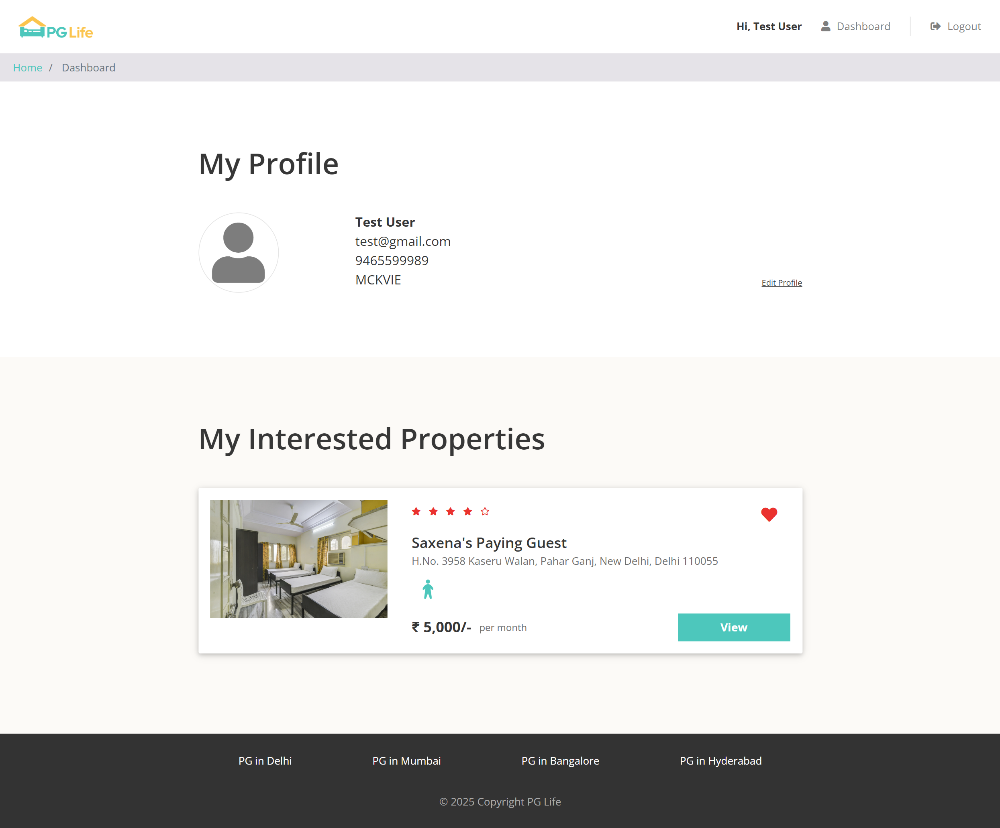

# 🏠 PGLife: Find Your Perfect PG Accommodation

   

Welcome to **PGLife**! A modern web application to help students and professionals find the best PG (Paying Guest) accommodations in major Indian cities. 🏙️

---

## ✨ Features
- 🔍 **Search PGs** by city
- 🏡 **View property details** with amenities
- 👦👧 **User authentication** (Sign up & Login)
- ⭐ **Rate & review** properties
- ❤️ **Mark properties as interested**
- 📱 **Responsive UI**

---

## 🛠️ Tech Stack
-  Backend
-  Frontend
-  Database
-  Local Server

---

## 📁 Folder Structure
```
PGLife/
├── api/           # PHP API endpoints
├── includes/      # PHP includes (DB, header, footer, modals)
├── react-app/     # React frontend app
├── css/           # Stylesheets
├── js/            # JavaScript files
├── img/           # Images
├── dummy_data.sql # Database seed file
├── index.php      # Main PHP entry
└── ...
```

---

## 🚦 Prerequisites
- [XAMPP](https://www.apachefriends.org/) (for Apache & MySQL)
- [Node.js & npm](https://nodejs.org/) (for React frontend)

---

## 🚀 Getting Started

### 1️⃣ Clone the Repository
```bash
git clone <your-repo-url>
cd PGLife
```

### 2️⃣ Setup the Database
1. Start **XAMPP** and run **Apache** & **MySQL** modules.
2. Open [phpMyAdmin](http://localhost/phpmyadmin).
3. Create a new database named `pglife`.
4. Import `dummy_data.sql` to populate tables:
   - Click the `Import` tab in phpMyAdmin
   - Select `dummy_data.sql` and execute

### 3️⃣ Configure PHP Backend
- Ensure your `includes/database_connect.php` has the correct DB credentials (default: `root`/no password for XAMPP).
- Place the project folder inside `C:/xampp/htdocs/` (or your XAMPP `htdocs` directory).
- Access the backend via [http://localhost/PGLife/index.php](http://localhost/PGLife/index.php)
- Access the frontend via [http://localhost/PGLife](http://localhost/PGLife)

### 4️⃣ Setup & Run React Frontend
```bash
cd react-app
npm install         # Install dependencies
npm start           # Start React dev server (default: http://localhost:3000)
```

### 5️⃣ Connect React with PHP Backend
- By default, React runs on port 3000 and PHP on port 80 (XAMPP).
- Update API URLs in React (if needed) to point to `http://localhost/PGLife/api/...`
- For production, build React and copy the `build/` folder to your PHP public directory if you want to serve via Apache.

---

## 🖼️ Screenshots / Demo

### 🏠 Home Page


### 📋 Property List


### 🏡 Property Detail


### 📊 Dashboard


---

## 🙏 Credits
- [Create React App](https://github.com/facebook/create-react-app)
- [XAMPP](https://www.apachefriends.org/)
- [FontAwesome](https://fontawesome.com/) for icons

---

## 👨‍💻 Developed By
- This project was developed by **Arup Maity**

---

## 📄 License
This project is for educational purposes. 